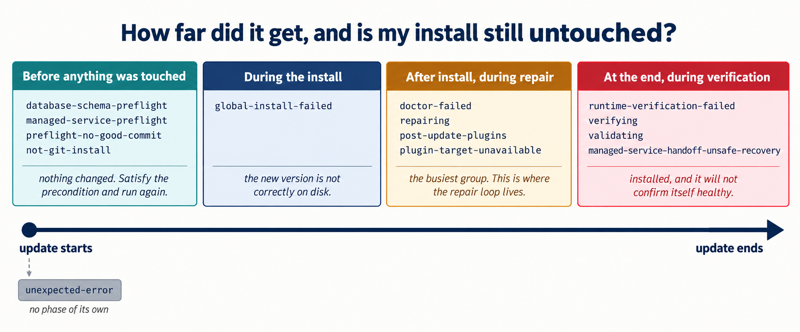

<!-- failure-phases.md (Chapter 6). The vendor's taxonomy, in time order. -->

# The failure-phase spine

OpenClaw files a structured report when an update fails. The `Failed phase` field takes values
from this set. Key your recovery rows to these rather than to error strings: **error text changes
between releases, phase names are structural.**

A filed report carries two fields, not one. `Failed phase` tells you **where**. `Reason code`
tells you **what**. `Rollback outcome` is the tool's own claim that going back is survivable,
and that claim is the one you verify with `rollback-gate.sh` rather than trusting.

## Before anything was touched

`database-schema-preflight` · `managed-service-preflight` · `preflight-no-good-commit` · `not-git-install`

Good news. The update stopped before changing anything, your install is exactly as it was, and
the fix is to satisfy the precondition and run again. Seeing `database-schema-preflight` here
means you skipped the rehearsal.

## During the install

`global-install-failed`

Something went wrong putting the new version on disk. Act on the install root: which directory,
which package manager, is the disk full, can you write there.

## After install, during repair

`doctor-failed` · `repairing` · `post-update-plugins` · `plugin-target-unavailable`

The busiest group, and where the repair loop lives. The one diagnosis that matters in the first
ninety seconds is whether each pass shows a **different** blocker or the **identical** one.
Different means you are peeling layers and it is working. Identical means stop.

## At the end, during verification

`runtime-verification-failed` · `verifying` · `validating` · `managed-service-handoff-unsafe-recovery`

Installed, and it won't confirm itself as healthy. Read that last one slowly: an *unsafe
recovery* during a *handoff* to a *managed service*. That is the supervised box, and it is why
chapter 9 spends time on who owns the process.

## And one with no place of its own

`unexpected-error`
