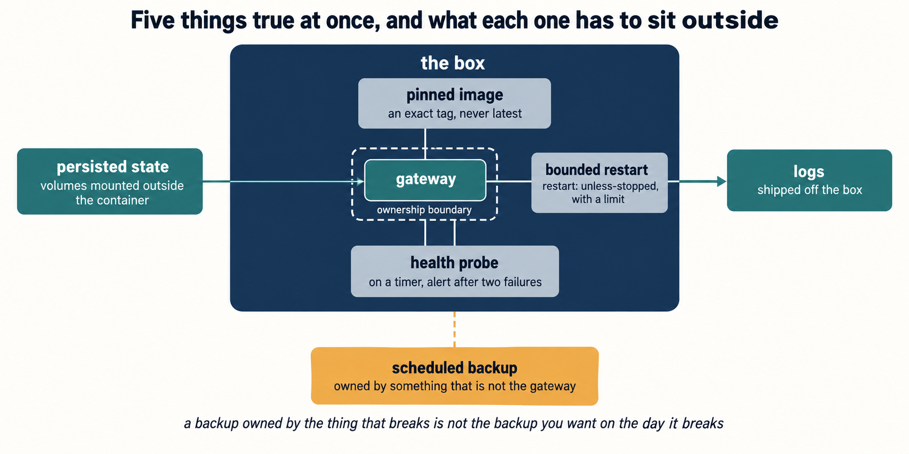

<!-- box-build.md (Chapter 9). Not a program. A numbered list of commands and one configuration file. -->

# The box build sequence

Pinned image, persisted state, health probe, bounded restart, logs. A restart policy on its own is
not resilience, and neither is a bigger machine.

Nine steps. A step with no verify line is a step you have not done.

**1. Size the box before you install anything.** If your agent will ever touch a browser, budget
for it: one headless Chromium can take a gigabyte, and the smallest tier is a machine that will
kill your gateway at an unpredictable hour.
*Verify:* you made this a decision and wrote down the reason.

**2. Install. Node floor first** (`node -v`, or `../03-install-inventory/node-floor.sh`), then
OpenClaw, then the setup wizard, which verifies model access with a live completion, and a key that
is present and a key that works are different states. Expect the install to be a step that can
fail. It isn't a formality.
*Verify:* `node --version` and `openclaw --version` both report what you intended.

**3. Persisted state.** Volumes for config, workspace and authentication, mounted **outside** the
container.
*Verify:* stop the container, remove it, start a new one from the same image, and confirm the
agent still knows who it is.

**4. Pinned version, on three surfaces.** An exact image tag, an exact OpenClaw version, and
plugins installed with `openclaw plugins install --pin`. People usually do one of the three.
*Verify:* `openclaw --version` matches your notes, and nothing in your configuration says `latest`.

**5. Bounded restart.** `restart: unless-stopped`, or your service manager's restart directive
plus its rate limit. The rate limit is the **bounded** part and it is the piece left at a default
that is often close to unlimited.
*Verify:* kill the process by hand and watch it come back. Then kill it repeatedly and confirm the
supervisor gives up rather than looping forever.

**6. Health probe.** `openclaw gateway probe` on a schedule, alerting after **two** consecutive
failures. One missed probe during a restart is normal, and you will start ignoring alerts within a
week if every one is noise. Read what it says, not just whether it returned: a probe that connects
to a gateway running the wrong version is a probe that passed and a box that is broken.
*Verify:* stop the gateway and wait. You get the alert you designed, in the window you designed.

**7. Logs.** Off the container: one that dies takes its filesystem with it, and the evidence goes
too. Document `openclaw gateway diagnostics export` on your runbook as the thing you produce before
asking anybody for help.
*Verify:* find yesterday's logs without opening the container.

**8. Decide the bind, deliberately, and author it.** Host installs bind to loopback; container
images default to an exposed bind. Never expose the gateway port without authentication in front of
it. Safest is loopback plus a private network or a tunnel, so it is not reachable from outside.
*Verify:* check it **from outside the box**, not from the box.

**9. The reboot test.** Reboot the machine. Touch nothing. Wait.
*Verify:* the agent answered on its own within the window your probe allows, and then a real
message through a real channel got a real reply. A gateway that starts and a gateway that works
are different claims.

---

## Your values

| | Yours |
|---|---|
| Box size, and why | |
| Image tag pinned to | |
| OpenClaw version pinned to | |
| Volume paths | |
| Restart limit | |
| Probe schedule and alert threshold | |
| Where logs go | |
| Bind, authored | |
| Monthly bill | _the margin sheet divides this across your runs_ |

---

## Two things to know before you build it

**Who owns the state.** `openclaw database ownership status` prints `Shared state is not externally
owned.` on a normal box. You do not need the claim counterpart here, and you do need to know it
exists, because that question is what turns into a corrupted database when two things both answer
"me". If something external supervises the gateway, the setting is the environment variable
`OPENCLAW_SUPERVISOR_MODE`, not a configuration key. Zero of the 6,518 paths at 2026.9.4 contain
"supervis", so `config set` gives you an unknown-path message on standard error, where a script
watching standard output never sees it.

**The scheduled backup is owned by the gateway.** *"The Gateway must be reachable while enabling or
disabling the schedule. There is no local fallback scheduler."* Gateway down, backups not running,
and no catching up, so your backup of last resort cannot live inside the thing you are backing up.
