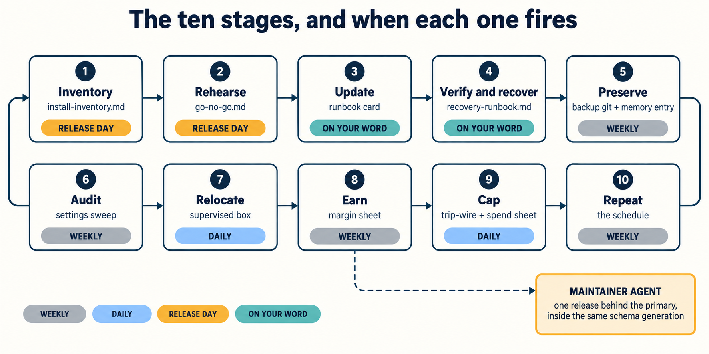

<!-- schedule.md (Chapter 12). What actually fires, and when. -->

# The schedule

Every stage is a command you have already run wrapped in a gate you have already written. Nothing
here is new software. If you find yourself writing something that needs its own maintenance, stop:
that is the growth boundary.

**Weekly, automatically.** `openclaw backup git create --repository <dir> --all --push`. Unchanged
database content produces no commit, so the log is a record of when your state actually changed
rather than daily noise you learn to ignore, and after a month you can see the upgrade days as
spikes. Plus `prove-authored.sh`, which catches a pin that came unpinned or a security-relevant key
a new release added. Plus a diff of the skills folder.

**Daily.** `tripwire.sh <ceiling>`, and `openclaw gateway probe` on its own timer, alerting after
two consecutive failures.

**On release day, owned by the maintainer.** Refresh the inventory. Snapshot, verify. Copy the
database and run `preflight-gate.sh` against the target **with the target's own binary**. Score
`go-no-go.md`. Rehearse. All read-only against production except the snapshot, which is why the
maintainer can own them.

**On your word only.** The real upgrade. And `openclaw update cleanup` a week later, if at all. It
retires the verified recovery originals and destroys your rollback path. It isn't housekeeping.

**Not on this list:** the gateway-owned `openclaw backup enable`. *"The Gateway must be reachable
while enabling or disabling the schedule. There is no local fallback scheduler."* A backup owned by
the thing that breaks is not the backup you want on the day it breaks.

---

## Your cron entries

Add each to `automations.md` with the why next to the what.

| What | When | Command | In automations.md |
|---|---|---|---|
| versioned backup | weekly | | |
| settings sweep | weekly | | |
| skills folder diff | weekly | | |
| spend trip-wire | daily | | |
| health probe | | | |

**First-pass time (chapter 5):**
**Cold-start time (chapter 12):**

_Both blank until you run them. The second should be smaller, and if it is not, the reason is in
one of the gaps the cold start exposed._
